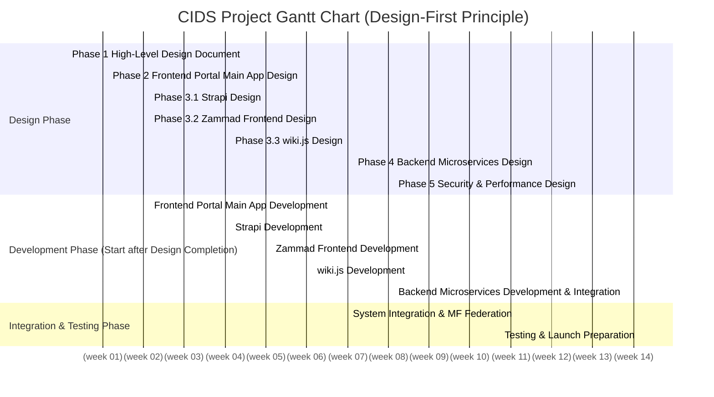

```mermaid
gantt
    title CIDS Project Gantt Chart (Design-First Principle)
    dateFormat  YYYY-MM-DD
    axisFormat  (week %W)  
    tickInterval 7          %// 每周一个刻度（更清晰）
    section Design Phase
        Phase 1 High-Level Design Document       :done,    des1, 2024-01-01, 7d    % Week1 (1 week)
        Phase 2 Frontend Portal Main App Design :done,    des2, 2024-01-08, 7d    % Week2 (1 week)
        Phase 3.1 Strapi Design                 :active,  des31, 2024-01-15, 14d  % Week3-4 (2 weeks)
        Phase 3.2 Zammad Frontend Design        :         des32, 2024-01-15, 21d  % Week3-5 (3 weeks)
        Phase 3.3 wiki.js Design                :         des33, 2024-01-29, 21d  % Week4-6 (3 weeks)
        Phase 4 Backend Microservices Design    :         des4, 2024-02-19, 7d    % Week7 (1 week)
        Phase 5 Security & Performance Design   :         des5, 2024-02-26, 7d    % Week8 (1 week)

    section Development Phase (Start after Design Completion)
        Frontend Portal Main App Development     :         dev1, 2024-01-15, 35d  % Starts after Phase2 → Week3-7 (5 weeks)
        Strapi Development                        :         dev2, 2024-01-29, 35d  % Starts after Phase3.1 → Week5-9 (5 weeks)
        Zammad Frontend Development               :         dev3, 2024-02-05, 35d  % Starts after Phase3.2 → Week6-10 (5 weeks)
        wiki.js Development                        :         dev4, 2024-02-12, 35d  % Starts after Phase3.3 → Week7-11 (5 weeks)
        Backend Microservices Development & Integration : dev5, 2024-02-26, 42d  % Starts after Phase4 → Week8-13 (6 weeks)

    section Integration & Testing Phase
        System Integration & MF Federation       :         int1, 2024-03-18, 21d  % Week14-16 (3 weeks)
        Testing & Launch Preparation             :         test1, 2024-04-08, 7d  % Week17 (1 week)
```