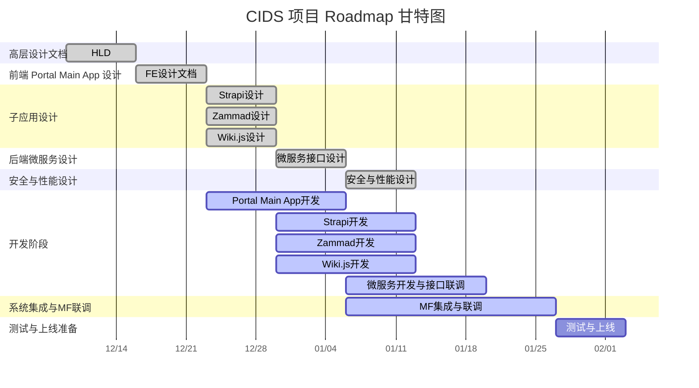

```mermaid
```mermaid
gantt
    title CIDS 项目 Roadmap 甘特图
    dateFormat  YYYY-MM-DD
    axisFormat  %m/%d

    %% 阶段 1
    section 高层设计文档
    HLD :done, hld, 2025-12-09, 7d

    %% 阶段 2
    section 前端 Portal Main App 设计
    FE设计文档 :done, fed, after hld, 7d

    %% 阶段 3
    section 子应用设计
    Strapi设计 :done, sdesign, after fed, 7d
    Zammad设计 :done, zdesign, after fed, 7d
    Wiki.js设计 :done, wdesign, after fed, 7d

    %% 阶段 4
    section 后端微服务设计
    微服务接口设计 :done, bdesign, after sdesign, 7d

    %% 阶段 5
    section 安全与性能设计
    安全与性能设计 :done, spdesign, after bdesign, 7d

    %% 阶段 6
    section 开发阶段
    Portal Main App开发 :active, fe_dev, after fed, 14d
    Strapi开发 :active, sdev, after sdesign, 14d
    Zammad开发 :active, zdev, after zdesign, 14d
    Wiki.js开发 :active, wdev, after wdesign, 14d
    微服务开发与接口联调 :active, bdev, after bdesign, 14d

    %% 阶段 7
    section 系统集成与MF联调
    MF集成与联调 :active, mf_int, after fe_dev, 21d

    %% 阶段 8
    section 测试与上线准备
    测试与上线 : 2026-01-27, 7d
```

```