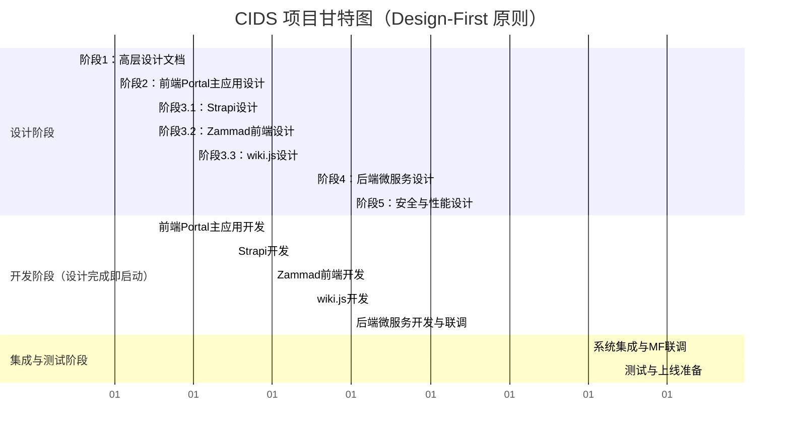

```mermaid
gantt
    title CIDS 项目甘特图（Design-First 原则）
    dateFormat  X
    axisFormat %d
    tickInterval 1  % 刻度间隔1周
    section 设计阶段
        阶段1：高层设计文档       :done,    des1, 1, 1  % Week 1（1周）
        阶段2：前端Portal主应用设计 :done,    des2, 2, 2  % Week 2（1周）
        阶段3.1：Strapi设计       :active,  des31, 3, 4  % Week3-4（2周）
        阶段3.2：Zammad前端设计    :         des32, 3, 5  % Week3-5（3周）
        阶段3.3：wiki.js设计       :         des33, 4, 6  % Week4-6（3周）
        阶段4：后端微服务设计      :         des4, 7, 7  % Week7（1周）
        阶段5：安全与性能设计      :         des5, 8, 8  % Week8（1周）
    
    section 开发阶段（设计完成即启动）
        前端Portal主应用开发      :         dev1, 3, 7  % 阶段2设计完成（Week2结束）→ Week3-7（5周）
        Strapi开发                :         dev2, 5, 9  % 阶段3.1设计完成（Week4结束）→ Week5-9（5周）
        Zammad前端开发            :         dev3, 6, 10  % 阶段3.2设计完成（Week5结束）→ Week6-10（5周）
        wiki.js开发               :         dev4, 7, 11  % 阶段3.3设计完成（Week6结束）→ Week7-11（5周）
        后端微服务开发与联调      :         dev5, 8, 13  % 阶段4设计完成（Week7结束）→ Week8-13（6周）
    
    section 集成与测试阶段
        系统集成与MF联调          :         int1, 14, 1  % Week14-16（3周）
        测试与上线准备            :         test1, 17, 17  % Week17（1周）
```