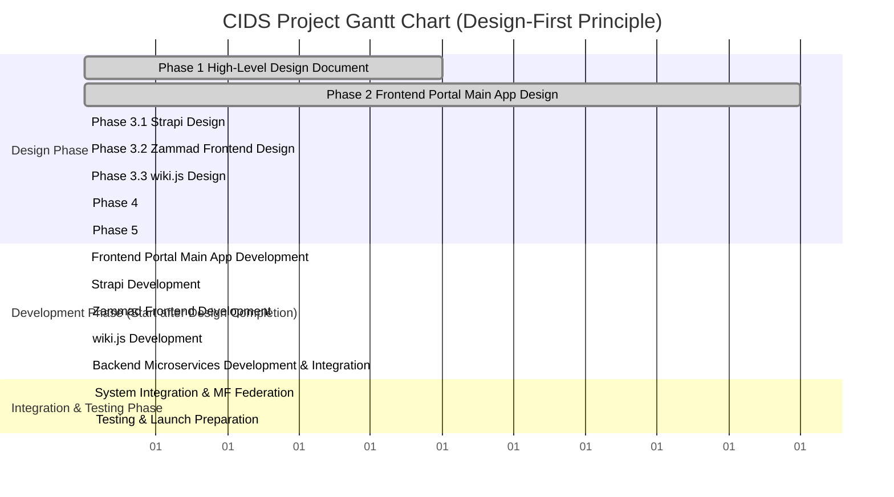

```mermaid
gantt
    title CIDS Project Gantt Chart (Design-First Principle)
    dateFormat  X
    axisFormat %d
    tickInterval 1

    section Design Phase
        Phase 1 High-Level Design Document       :done,    des1, 1, 1
        Phase 2 Frontend Portal Main App Design :done,    des2, 2, 2
        Phase 3.1 Strapi Design                 :active,  des31, 3, 4  % Week3-4 (2 weeks)
        Phase 3.2 Zammad Frontend Design        :         des32, 3, 5  % Week3-5 (3 weeks)
        Phase 3.3 wiki.js Design                :         des33, 4, 6  % Week4-6 (3 weeks)
        Phase 4: Backend Microservices Design    :         des4, 7, 7  % Week7 (1 week)
        Phase 5: Security & Performance Design  :         des5, 8, 8  % Week8 (1 week)

    section Development Phase (Start after Design Completion)
        Frontend Portal Main App Development     :         dev1, 3, 7  % Phase 2 design completed → Week3-7 (5 weeks)
        Strapi Development                        :         dev2, 5, 9  % Phase 3.1 design completed → Week5-9 (5 weeks)
        Zammad Frontend Development               :         dev3, 6, 10 % Phase 3.2 design completed → Week6-10 (5 weeks)
        wiki.js Development                        :         dev4, 7, 11 % Phase 3.3 design completed → Week7-11 (5 weeks)
        Backend Microservices Development & Integration : dev5, 8, 13 % Phase 4 design completed → Week8-13 (6 weeks)

    section Integration & Testing Phase
        System Integration & MF Federation       :         int1, 14, 16 % Week14-16 (3 weeks)
        Testing & Launch Preparation             :         test1, 17, 17 % Week17 (1 week)

```